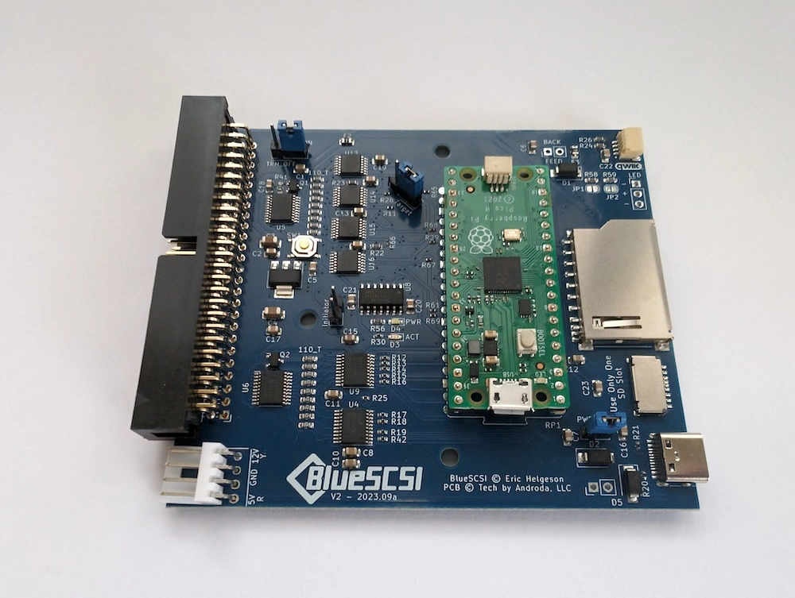
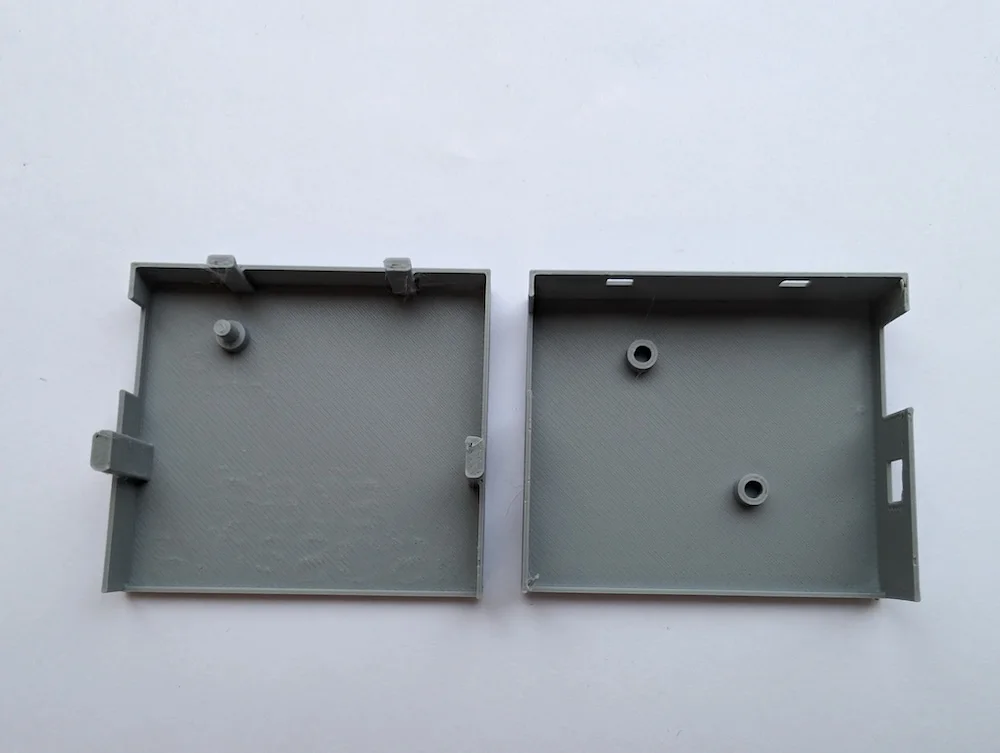
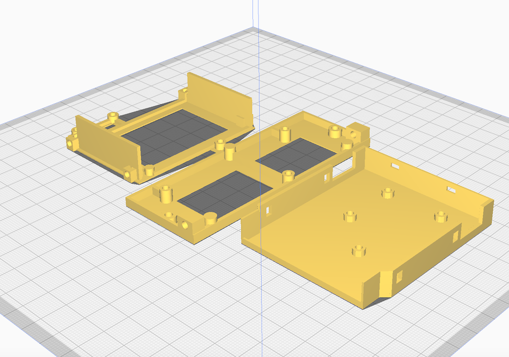

&#8593;View our Categories menu for Product Page Links. Access your Cart and Checkout pages from the menu&#8593;

<!-- Section-->
        <section class="py-5">
            

                

                    

                        

                            <!-- Sale badge-->
                            
UK

                            <!-- Product image-->
                            
                            <!-- Product details-->
                            

                                

                                    <!-- Product name-->
                                    <h5 class="fw-bolder">BlueSCSI Products UK</h5>
                                    <!-- Product price-->
                                    From £32.00
                                

                            

                            <!-- Product actions-->
                            

                                
<a class="btn btn-outline-dark mt-auto" href="/uk">View options</a>

                            

                        

                    

                    

                        

                            <!-- Sale badge-->
                            
EU

                            <!-- Product image-->
                            
                            <!-- Product details-->
                            

                                

                                    <!-- Product name-->
                                    <h5 class="fw-bolder">BlueSCSI Products EU</h5>
                                    <!-- Product price-->
                                    From £54.00
                                

                            

                            <!-- Product actions-->
                            

                                
<a class="btn btn-outline-dark mt-auto" href="/eu">View options</a>

                            

                        

                    

                    

                        

                            <!-- Sale badge-->
                            
New

                            <!-- Product image-->
                            
                            <!-- Product details-->
                            

                                

                                    <!-- Product name-->
                                    <h5 class="fw-bolder">Amiga Products</h5>
                                    <!-- Product price-->
                                    From £75.00
                                

                            

                            <!-- Product actions-->
                            

                                
<a class="btn btn-outline-dark mt-auto" href="/amiga">View option</a>

                            

                        

                    

                    

                        

                            <!-- Product image-->
                            
                            <!-- Product details-->
                            

                                

                                    <!-- Product name-->
                                    <h5 class="fw-bolder">3D Prints</h5>
                                    <!-- Product price-->
                                    From £2.00
                                

                            

                            <!-- Product actions-->
                            

                                
<a class="btn btn-outline-dark mt-auto" href="/3dprints">View options</a>

                            

                        

                    

All our prices <b>include</b> delivery, but please make sure you "Add to Cart" from the 🇪🇺 EU Product pages if you are purchasing from the <b>Europe or the Rest of the world</b>. If you purchase multiple items you will get a "Shipping Discount". This will show on the Checkout page.

We are the UK registered distributor for the BlueSCSI, and the project creators will get a share of every purchase. Click the buttons below to view the Github pages for more info on the BlueSCSI.

    <a href="https://github.com/erichelgeson/BlueSCSI" target="_blank" class="btn btn-lg btn-primary">V1 Github</a>&nbsp;<a href="https://github.com/BlueSCSI" target="_blank" class="btn btn-lg btn-primary">V2 Github</a>

            
Your registered Paypal delivery address will be used so please make sure it is correct before purchasing. You can see our current stock numbers on this page <a href="/stock">CURRENT STOCK.</a> View our Return/Refund policy <a href="/return">HERE.</a> Please see our page with info about <a href="/print">3D Prints</a> for the BlueSCSI. Please view the BlueSCSI Version 2 help docs here <a href="https://bluescsi.com/docs/" target="_blank">https://bluescsi.com/docs/</a> Please download the PDF files below for Version 1 instructions about usage and assembly. 

<a href="/assets/pdfs/BlueSCSI_Instructions.pdf" target="_blank">&#9989;V1 Usage Instructions PDF</a>
<a href="/assets/pdfs/BlueSCSI_assembly.pdf" target="_blank">&#9989;V1 Desktop Assembly Instructions PDF</a>
<a href="/assets/pdfs/BlueSCSI_Assembly_DB25.pdf" target="_blank">&#9989;V1 DB25 Assembly Instructions PDF</a>