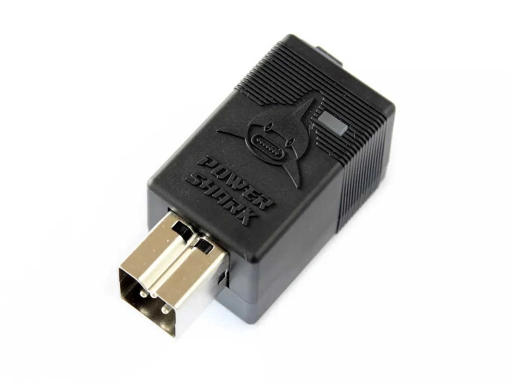

&#8593;View our Categories menu for Product Page Links. Access your Cart and Checkout pages from the menu&#8593;

<!-- Section-->
        <section class="py-5">
            

                

                    

                        

                            <!-- Sale badge-->
                            
NEW Ultra

                            <!-- Product image-->
                            
                            <!-- Product details-->
                            

                                

                                    <!-- Product name-->
                                    <h5 class="fw-bolder">BlueSCSI</h5>
                                    <!-- Product price-->
                                    From £32.00
                                

                            

                            <!-- Product actions-->
                            

                                
<a class="btn btn-outline-dark mt-auto" href="/bluescsi">View options</a>

                            

                        

                    

                    

                        

                            <!-- Sale badge-->
                            
New

                            <!-- Product image-->
                            
                            <!-- Product details-->
                            

                                

                                    <!-- Product name-->
                                    <h5 class="fw-bolder">Amiga Products</h5>
                                    <!-- Product price-->
                                    From £10.00
                                

                            

                            <!-- Product actions-->
                            

                                
<a class="btn btn-outline-dark mt-auto" href="/amiga">View options</a>

                            

                        

                    

                    

                        

                            <!-- Sale badge-->
                            
New Revision

                            <!-- Product image-->
                            
                            <!-- Product details-->
                            

                                

                                    <!-- Product name-->
                                    <h5 class="fw-bolder">PicoGUS Products</h5>
                                    <!-- Product price-->
                                    From £50.00
                                

                            

                            <!-- Product actions-->
                            

                                
<a class="btn btn-outline-dark mt-auto" href="/picogus">View options</a>

                            

                        

                    

                    

                        

                            <!-- Sale badge-->
                            
New Features

                            <!-- Product image-->
                            
                            <!-- Product details-->
                            

                                

                                    <!-- Product name-->
                                    <h5 class="fw-bolder">PicoMEM Products</h5>
                                    <!-- Product price-->
                                    From £46.00
                                

                            

                            <!-- Product actions-->
                            

                                
<a class="btn btn-outline-dark mt-auto" href="/picomem">View options</a>

                            

                        

                    

                    

                        

                            <!-- Sale badge-->
                            
Coming soon

                            <!-- Product image-->
                            
                            <!-- Product details-->
                            

                                

                                    <!-- Product name-->
                                    <h5 class="fw-bolder">PicoIDE</h5>
                                    <!-- Product price-->
                                    From £--.--
                                

                            

                            <!-- Product actions-->
                            

                                
<a class="btn btn-outline-dark mt-auto" href="/picoide">View options</a>

                            

                        

                    
                    
                    

                        

                            <!-- Product image-->
                            
                            <!-- Product details-->
                            

                                

                                    <!-- Product name-->
                                    <h5 class="fw-bolder">3D Prints</h5>
                                    <!-- Product price-->
                                    From £4.00
                                

                            

                            <!-- Product actions-->
                            

                                
<a class="btn btn-outline-dark mt-auto" href="/print">View options</a>

                            

                        

                    

All our prices <b>include</b> delivery, but please make sure you choose your delivery region from the dropdown on each product page. If you purchase multiple items you will get a "Shipping Discount". This will show on the Checkout page.

Your registered Paypal delivery address will be used so please make sure it is correct before purchasing. Please see information on our stock on this page <a href="/stock">STOCK INFO.</a> View our Return/Refund policy <a href="/return">HERE.</a> Please see our page with info about <a href="/print">3D Prints</a>. 
 
        

          
        
