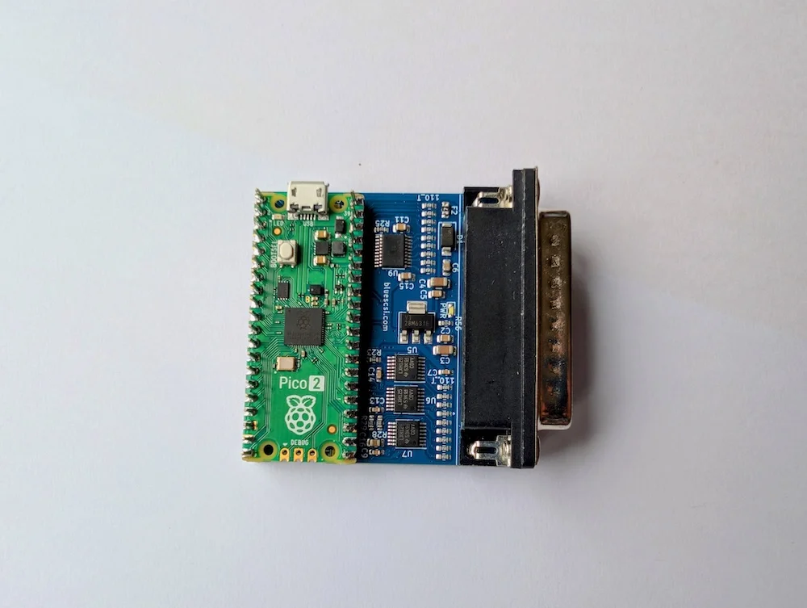

&#8593;View our Categories menu for Product Page Links. Access your Cart and Checkout pages from the menu&#8593;

<!-- Section-->
        <section class="py-5">
            

                

                    

                        

                            <!-- Sale badge-->
                            
UK ONLY

                            <!-- Product image-->
                            
                            <!-- Product details-->
                            

                                

                                    <!-- Product name-->
                                    <h5 class="fw-bolder">BlueSCSI Products UK</h5>
                                    <!-- Product price-->
                                    From £32.00
                                

                            

                            <!-- Product actions-->
                            

                                
<a class="btn btn-outline-dark mt-auto" href="/uk">View options</a>

                            

                        

                    

                    

                        

                            <!-- Sale badge-->
                            
ROW

                            <!-- Product image-->
                            
                            <!-- Product details-->
                            

                                

                                    <!-- Product name-->
                                    <h5 class="fw-bolder">BlueSCSI Products Rest of the World</h5>
                                    <!-- Product price-->
                                    From £48.00
                                

                            

                            <!-- Product actions-->
                            

                                
<a class="btn btn-outline-dark mt-auto" href="/eu">View options</a>

                            

                        

                    

                    

                        

                            <!-- Sale badge-->
                            
New

                            <!-- Product image-->
                            
                            <!-- Product details-->
                            

                                

                                    <!-- Product name-->
                                    <h5 class="fw-bolder">Amiga Products</h5>
                                    <!-- Product price-->
                                    From £33.00
                                

                            

                            <!-- Product actions-->
                            

                                
<a class="btn btn-outline-dark mt-auto" href="/amiga">View options</a>

                            

                        

                    

                    

                        

                            <!-- Sale badge-->
                            
New

                            <!-- Product image-->
                            
                            <!-- Product details-->
                            

                                

                                    <!-- Product name-->
                                    <h5 class="fw-bolder">PicoGUS Products</h5>
                                    <!-- Product price-->
                                    From £58.00
                                

                            

                            <!-- Product actions-->
                            

                                
<a class="btn btn-outline-dark mt-auto" href="/picogus">View options</a>

                            

                        

                    

                    

                        

                            <!-- Sale badge-->
                            
New

                            <!-- Product image-->
                            
                            <!-- Product details-->
                            

                                

                                    <!-- Product name-->
                                    <h5 class="fw-bolder">PicoMEM Products</h5>
                                    <!-- Product price-->
                                    From £55.00
                                

                            

                            <!-- Product actions-->
                            

                                
<a class="btn btn-outline-dark mt-auto" href="/picomem">View options</a>

                            

                        

                    
                    
                    

                        

                            <!-- Product image-->
                            
                            <!-- Product details-->
                            

                                

                                    <!-- Product name-->
                                    <h5 class="fw-bolder">3D Prints</h5>
                                    <!-- Product price-->
                                    From £2.00
                                

                            

                            <!-- Product actions-->
                            

                                
<a class="btn btn-outline-dark mt-auto" href="/3dprints">View options</a>

                            

                        

                    

All our prices <b>include</b> delivery, but please make sure you "Add to Cart" from the 🇪🇺🇺🇸 EU/ROW Product pages if you are purchasing from the <b>Europe or the Rest of the world</b>. If you purchase multiple items you will get a "Shipping Discount". This will show on the Checkout page.

Your registered Paypal delivery address will be used so please make sure it is correct before purchasing. You can see our current stock numbers on this page <a href="/stock">CURRENT STOCK.</a> View our Return/Refund policy <a href="/return">HERE.</a> Please see our page with info about <a href="/print">3D Prints</a>.

We will be increasing our 3D Print options in future so keep checking our print store page. Thanks for visting.